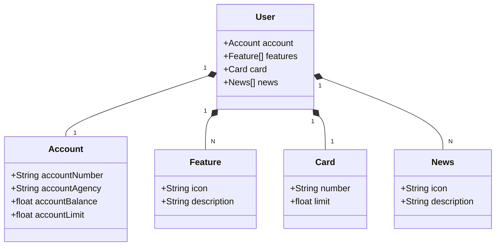

# API-RESTful-Santander

## Diagrama de Classes

```mermaid
classDiagram
    class User {
        +Account account
        +Feature[] features
        +Card card
        +News[] news
    }

    class Account {
        +String accountNumber
        +String accountAgency
        +float accountBalance
        +float accountLimit
    }

    class Feature {
        +String icon
        +String description
    }

    class Card {
        +String number
        +float limit
    }

    class News {
        +String icon
        +String description
    }

    User "1" *-- "1" Account
    User "1" *-- "N" Feature
    User "1" *-- "1" Card
    User "1" *-- "N" News

```
